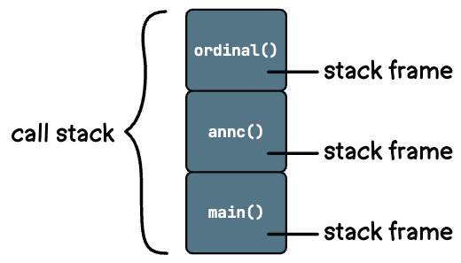
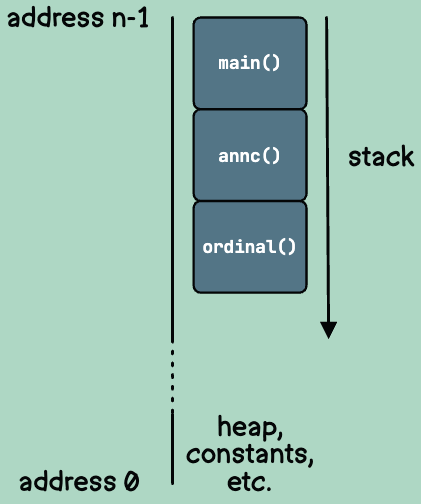
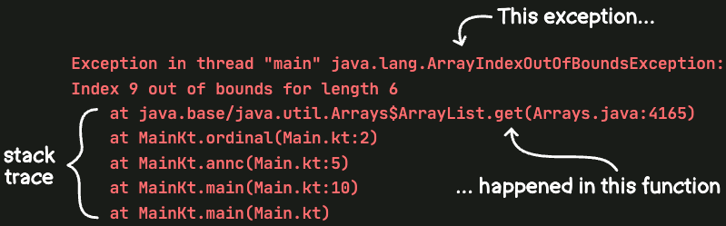
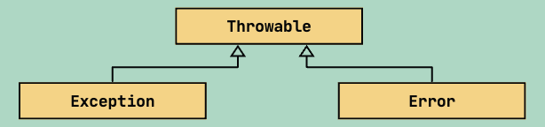

# Exception Handling

## What is a call stack and what is a stack trace

### What is a call stack

The *call stack* also sometimes known as just *the stack* is the stack of function calls our program has made during
runtime.



#### Fun facts about call stack

Each stack frame takes up actual space in the memory on your computer. Each slot of memory has an address, starting at
zero and increasing up to the amount of memory allocated to your program. Interestingly, in most computer systems, the
call stack actually starts at the highest memory address—that is, the slot whose address is the biggest number. Then,
when a frame is added to the stack, it gets an address just below the previous frame’s address.

because of the way a call stack takes up space in memory, starting at the highest memory address, developers usually
consider it to grow downward—i.e., toward memory address zero.

So when a programmer says that something’s at the top of the call stack, sometimes they really mean that it’s at the
first frame in the stack (i.e., the main() function in Kotlin). Other times, though, a developer who says “top of the
stack” might mean the last frame, as found in some of Java’s documentation.



### What is a stack trace

A snapshot of the call stack at the moment when an error has occurred is known as a *stack trace*.



### What is Compile Time

This is the time before actually running any of our code. This is like when the plumber is laying out all the pipes
and connecting everything together.

### What is Runtime

This the time when our application is actually running the code we wrote. This like actually turning on the water and
seeing if the pipes leak.

## Exceptions

Exception is a subclass of a class called Throwable. Any instance of Throwable or its subclasses can be used with the
throw keyword. There’s a second category of throwables that’s a sibling to Exception, named Error.

A subclass as all of the properties of the parent class. Aka if Throwable has `cool cat` Exception and Throwable would 
inherit those as well.



Whereas Exception usually represents a deviation from the normal flow of code, an Error typically represents a more
severe condition—one which we can’t recover from, such as when the system runs out of memory. Although it’s possible to
catch these, there’s usually not much you can do with them. So, you’ll rarely need to catch anything other than
exceptions.

### When do we need to a specific exception vs a generic catch block?

We would want to use a specific exception type if want to handle an exception in a specific way. For example if we know
that there is a high possibility that we could attempt to read from the database and get an EntityNotFound exception due
to record we were looking for not existing. Instead of having the program crash we instead want to handle that exception
gracefully.

We would want to use a generic catch block for any exceptions we are not planning on happening, but still want to ensure
the program continues to run and not crash. We will use specific exception to catch exceptions we know are likely to 
happen and ensure handle those accordingly and then use a generic for a catch-all for any other exceptions that might 
happen.

### What is the finally block

A finally block will run after the rest of the expression is processed, regardless of whether an exception was thrown.

A finally block is typically most helpful with resources that need to be closed. For example, if our program reads a
file on the computer’s hard drive, we’ll want to make sure that we close it when we’re done with it, even if an
exception is thrown while processing it.

```kotlin
try { 
    faucet.turnOn() 
    watch(sprinkler) // SprinklerBrokenException is thrown here 
} catch (e: SprinklerBrokenException) { 
    store.orderNewSprinkler() 
} finally { 
    faucet.turnOff() // This will run, even when the sprinkler breaks!
}
```

#### Fun Fact

When your Kotlin code targets the JVM, you might use a resource that implements the Closeable interface, such as a
FileReader.

When doing this, rather than using try-finally directly, you can use an extension function named use(). It will
automatically close the resource, regardless of whether an exception is thrown.

```kotlin
FileReader(file).use { reader ->
    // Use the FileReader here
}
```

You can also use finally without the catch block. At minimum though a try expression must have either a catch block or a
finally block.

### Scenario Examples

#### Catch an exception and perform an action WITHOUT throwing to the caller

When we are doing checks to see if something exists before creating it. For example lets say we want to create a new
sandbox, but first we will check to see if it exists first. We don't throw to the caller since we expect an error to be
thrown as it's a part of our flow.

```kotlin
fun cleanupResources(resourceIds: List<String>) {
    resourceIds.forEach { id ->
        try {
            deleteResource(id)
            logger.info { "Successfully deleted resource: $id" }
        } catch (e: Exception) {
            // Log but continue with other resources
            logger.warn { "Failed to delete resource $id: ${e.message}" }
        }
    }
}
```

#### Catch an exception, perform an action, and rethrow the exception to the caller

We would do this when an error occurred, but the operation still failed and the caller needs to know.
The operation objectively failed, and the caller must be informed so they can handle it appropriately.

```kotlin
try {
    processPayment(orderId, amount)
} catch (e: Exception) {
    logger.error { "Payment processing failed for order $orderId: ${e.message}" }

    // Wrap in a more specific exception with context
    throw PaymentProcessingException(
        "Failed to process payment for order $orderId",
        cause = e
    )
}
```

### Do not catch an exception but catch within the parent caller
When lower-level functions should not handle errors themselves because they lack the context to handle them 
appropriately. The parent caller has better understanding of what to do when an error occurs - whether to retry, return
a specific response code, rollback a transaction, etc. This keeps error handling logic centralized and contextual.


```kotlin
// None of these catch exceptions
fun validateUser(userId: String) {
    if (userId.isBlank()) throw ValidationException("User ID cannot be blank")
}

fun fetchUserData(userId: String): UserData {
    return userRepository.findById(userId)  // May throw NotFoundException
}

fun updateUserPreferences(userData: UserData, prefs: Preferences) {
    userRepository.update(userData.copy(preferences = prefs))  // May throw DatabaseException
}

// Parent function catches all exceptions from helpers
fun updateUserSettings(userId: String, prefs: Preferences) {
    try {
        validateUser(userId)
        val userData = fetchUserData(userId)
        updateUserPreferences(userData, prefs)
        logger.info { "Successfully updated settings for user $userId" }
    } catch (e: ValidationException) {
        logger.warn { "Invalid user settings update: ${e.message}" }
        throw e
    } catch (e: NotFoundException) {
        logger.warn { "User not found: $userId" }
        throw e
    } catch (e: Exception) {
        logger.error { "Failed to update user settings: ${e.message}" }
        throw UserSettingsException("Could not update settings for $userId", e)
    }
}
```

### Catch and exception and not throw anything

We use this pattern when an operation fails, but the failure is acceptable and doesn't warrant failing the overall
operation. Instead, we catch and log the error for awareness, but allow execution to continue successfully.

```kotlin
fun processOrder(orderId: String) {
    val order = orderRepository.save(createOrder(orderId))

    // Try to send confirmation email, but don't fail if it doesn't work
    try {
        emailService.sendOrderConfirmation(order)
        logger.info { "Order confirmation sent for $orderId" }
    } catch (e: Exception) {
        logger.warn { "Could not send order confirmation email for $orderId: ${e.message}" }
        // Don't throw - order is still successfully processed
    }

    logger.info { "Order $orderId processed successfully" }
}
```

## References

- Dave Leeds' [Kotlin: An Illustrated Guide](https://typealias.com/start/)
